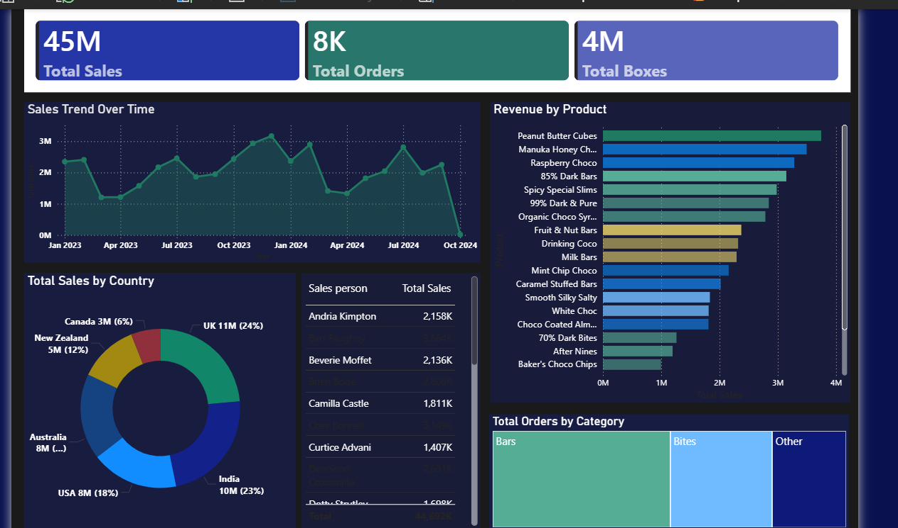

# 📊 Power BI Sales Analysis Project

## Overview

This project analyzes sales data using Power BI to gain insights into revenue, customer behavior, and performance trends.

## Tools Used

* Power BI
* Excel / CSV

## 📊 Key Insights

- 📈 Total Sales reached **45M**, showing strong overall performance  
- 🛒 Total Orders are **8K**, indicating steady customer demand  
- 📦 Total Boxes sold: **4M**

### 📉 Sales Trend
- Sales show fluctuations with peaks around late 2023 and mid 2024  
- A sharp drop is observed at the end — needs investigation  

### 🌍 Country-wise Sales
- UK contributes highest (**24%**)  
- India and USA also contribute significantly  
- New Zealand has the lowest share  

### 🏆 Top Products
- Peanut Butter Cubes generate highest revenue  
- Premium products dominate top positions  

### 📦 Category Insights
- Bars category contributes most orders  
- Other categories have comparatively lower performance  
## 📂 Files Included

 "C:\Users\yasmi\OneDrive\Desktop\Project\Sales_Project_ColorCoding_PBI.pbix" – Power BI dashboard

How to Use :

1. Download the `.pbix` file
2. Open in Power BI Desktop
3. Explore the dashboard

📸 Dashboard Preview

